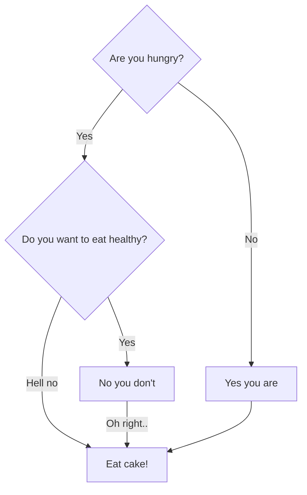

# Entête 1

## Entête 2

### Entête 3


```
$ bla bla some code
Some results
```

- [x] some list item
- [x] done 
- [ ] not done


- [ ] task 1
- [ ] task 2
- [ ] task 3



```mermaid
graph TD
    
    A{Are you hungry?}
    A -->|Yes| B{Do you want to eat healthy?}
    B -->|Hell no| Cake
    B -->|Yes| C[No you don't]
    C -->|Oh right..| Cake
    A -->|No| E[Yes you are]
    E --> Cake[Yes you are]
    Cake[Eat cake!]

```
